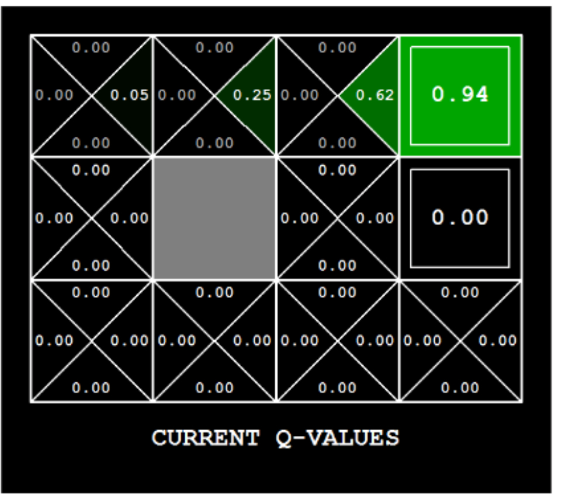

# Introduction to Reinforcement Learning

In this project, you will implement Q-learning. You will test your agents first on Gridworld (from class), then apply them to a simulated robot controller (Crawler) and Pacman.

## Files

The code for this project contains the following files:

### Files you will edit:

- [`qlearningAgents.py`](qlearningAgents.py) - Q-learning agents for Gridworld, Crawler and Pacman.
- [`analysis.py`](analysis.py) - A file to put your answers to questions given in the project.

### Files you should read but NOT edit

- [`valueIterationAgents.py`](valueIterationAgents.py) - A value iteration agent for solving known MDPs.
- [`mdp.py`](mdp.py) - Defines methods on general MDPs.
- [`learningAgents.py`](learningAgents.py) - Defines the base classes ValueEstimationAgent and QLearningAgent, which your agents will extend.
- [`util.py`](util.py) - Utilities, including util.Counter, which is particularly useful for Q-learners.
- [`gridworld.py`](gridworld.py) - The Gridworld implementation.
- [`featureExtractors.py`](featureExtractors.py) - Classes for extracting features on (state,action) pairs. Used for the approximate Q-learning agent (in qlearningAgents.py).

### Files you can ignore

- [`environment.py`](environment.py) - Abstract class for general reinforcement learning environments. Used by gridworld.py.
- [`graphicsGridworldDisplay.py`](graphicsGridworldDisplay.py) - Gridworld graphical display.
- [`graphicsUtils.py`](graphicsUtils.py) - Graphics utilities.
- [`textGridworldDisplay.py`](textGridworldDisplay.py) - Plug-in for the Gridworld text interface.
- [`crawler.py`](crawler.py) - The crawler code and test harness. You will run this but not edit it.
- [`graphicsCrawlerDisplay.py`](graphicsCrawlerDisplay.py) - GUI for the crawler robot

## Implementation Instructions

Carefully read the instructions for each phase before you start. Make sure you are only implementing the procedures specifically asked for in the instructions. Do not jump ahead and implement phases that are not yet required.

### Phase 1: Q-learning

You will now write a Q-learning agent, which does very little on construction, but instead learns by trial and error from interactions with the environment through its update (state, action, nextState, reward) method. A stub of a Q-learner is specified in QLearningAgent in `qlearningAgents.py`, and you can select it with the option '-a q'. For this question, you must implement the update, getValue, getQValue, and getPolicy methods.

**Note:** For getPolicy, you should break ties randomly for better behavior. The `random.choice()` function will help. In a particular state, actions that your agent hasn't seen before still have a Q-value, specifically a Q-value of zero, and if all of the actions that your agent has seen before have a negative Q-value, an unseen action may be optimal.

**Important:** Make sure that in your getValue and getPolicy functions, you only access Q values by calling getQValue. This abstraction will be helpful for questions 4 or 5, when you override getQValue to use features of state-action pairs rather than state-action pairs directly.

With the Q-learning update in place, you can watch your Q-learner learn under manual control, using the keyboard.

```zsh
# Watch Q-learner Learn under manual control

python3 gridworld.py -a q -k 5 -m
```

The -k parameter controls the number of episodes your agent learns from. Watch how the agent learns about the state it was just in, not the one it moves to, and "leaves learning in its wake."

*Hint: to help with debugging, you can turn off noise by using the --noise 0.0 parameter (though
this obviously makes Q-learning less interesting).*

If you manually steer Pacman north and then east along the optimal path for four episodes, you should see the following Q-values:



**Implementation Steps:**
  1. Read and understand the classes and methods available in these files:
   - [`valueIterationAgents.py`](valueIterationAgents.py) - A value iteration agent for solving known MDPs
   - [`mdp.py`](mdp.py) - Defines methods on general MDPs
   - [`learningAgents.py`](learningAgents.py) - Defines the base classes ValueEstimationAgent and QLearningAgent, which your agents will extend
   - [`util.py`](util.py) - Utilities, including util.Counter, which is particularly useful for Q-learners
   - [`gridworld.py`](gridworld.py) - The Gridworld implementation
   - [`featureExtractors.py`](featureExtractors.py) - Classes for extracting features on (state,action) pairs
  2. Examine `QLearningAgent` class in [`qlearningAgents.py`](qlearningAgents.py)    
   - [ ] Document how the `getValue` and `getPolicy` procedures are initially implemented. Explain what the default implementation does in [`analysis.py'](analysis.py).
   - [ ] Read the hints and implement `update` method, deleting only `util.raiseNotDefined()`.
   - [ ] Read the hints and implement `getQValue` method, deleting only `util.raiseNotDefined()`
   - [ ] Will you change `getValue` and `getPolicy` procedures?  Why?
   - [ ] Add a question [analysis.py](./analysis.py):`What was your implentation strategy for Q-Learning? Explain.`
   - [ ] Run the test cases underneath [`test_cases/q1`](./test_cases/q1/CONFIG)
   - [ ] Explain the implementation strategy in analysis.py

---

### Phase 2: Epsilon Greedy

Complete your Q-learning agent by implementing epsilon-greedy action selection in the `getAction` method. Epsilon-greedy is an exploration strategy that balances exploitation (choosing the best known action) with exploration (trying random actions to discover potentially better options).

**How Epsilon-Greedy Works:**

With probability **epsilon (ε)**, the agent chooses a random action uniformly from all legal actions. With probability **(1 - ε)**, the agent chooses the action that maximizes the Q-value (i.e., follows its current best policy). This mechanism ensures the agent doesn't get stuck exploiting a suboptimal policy and continues to explore the state-action space.

**Testing Your Implementation:**

```zsh
python3 gridworld.py -a q -k 100
```

Your final Q-values should resemble those of your value iteration agent, especially along well-traveled paths. However, your average returns will be lower than the Q-values predict because of the random actions and the initial learning phase.

**Useful Functions:**

- `random.choice(list)` - Choose an element from a list uniformly at random
- `util.flipCoin(p)` - Returns `True` with probability `p` and `False` with probability `1-p`

**Implementation Steps:**

1. Examine the `getAction` method stub in `QLearningAgent`
2. Implement the epsilon-greedy logic:
   - [ ] With probability `self.epsilon`, return a random action from `self.getLegalActions(state)`
   - [ ] Otherwise, return the action from `self.getPolicy(state)`
   - [ ] Handle the case where there are no legal actions (return `None`)
3. Test your implementation:
   - [ ] Run `python3 gridworld.py -a q -k 100` and observe Q-value convergence
   - [ ] Run the test cases underneath [`test_cases/q2`](./test_cases/q2/CONFIG)
4. Answer in [`analysis.py`](./analysis.py):
   - [ ] `What is the output from running 'python3 gridworld.py -a q -k 100'?`
   - [ ] `What is the output of each of the test cases underneath test_cases/q2?`
   - [ ] `What is your implementation strategy for Phase 2 (Epsilon Greedy)? Explain.`

---

### Phase 3: Q-Learning Generalization (Crawler Robot)

With no additional code changes, you should now be able to run a Q-learning crawler robot. This phase tests whether your Q-learning implementation is general enough to work beyond the GridWorld environment.

**Running the Crawler:**

```zsh
python3 crawler.py
```

The crawler is a simulated robot that learns to move forward by adjusting its arm and hand angles. Your Q-learning agent will learn a policy that makes the robot "crawl" forward efficiently.

**If this doesn't work**, you've probably written some code too specific to the GridWorld problem and you should make it more general to all MDPs.

**Interactive Parameters:**

Play around with the various learning parameters to see how they affect the agent's policies and actions:

- **Step Delay** - A parameter of the simulation (visualization speed)
- **Learning Rate (α)** - How quickly new information overrides old Q-values
- **Epsilon (ε)** - Exploration rate for epsilon-greedy action selection  
- **Discount Factor (γ)** - How much future rewards are valued relative to immediate rewards

**Observed Behaviors When Adjusting Parameters:**

**Lower Learning Rate (α = 0.3):**
- Learned to walk around step 1,200
- Learned to take small steps

**Higher Learning Rate (α = 0.95):**
- Learned to walk around step 800
- Learned to scoot itself with long pulls

**Lower Epsilon (ε = 0.2):**
- Learned to start walking around step 1,000 inefficiently
- At step 3,000, began moving more efficiently

**Higher Epsilon (ε = 0.8):**
- Range of motion of arm was more pronounced early on
- Even made some backwards movements but then started moving forwards very early
- Never really learned and stuck with a movement though
- Even at step 3000, the motion of the arm seemed chaotic

**Implementation Steps:**

1. Run the crawler and observe the learning behavior:
   - [ ] Execute `python3 crawler.py`
   - [ ] Watch the robot learn to crawl forward
2. Experiment with parameters:
   - [ ] Adjust learning rate and observe the effect on convergence speed
   - [ ] Adjust epsilon and observe the effect on exploration vs exploitation
   - [ ] Adjust discount factor and observe how it affects long-term planning
3. Answer in [`analysis.py`](./analysis.py):
   - [ ] `What happens when you run python crawler.py? Describe the robot's behavior and learning process.`
   - [ ] `What values did you use for the learning rate? What did you observe the effect was on convergence speed?`
   - [ ] `What values did you use for epsilon? What did you observe the effect was on on exploration vs exploitation?`
   - [ ] `What values did you use for discount factor? What did you observe the effect was on on long-term planning?`
4. Run test cases and document results:
   - [ ] Run the test cases underneath [`test_cases/q3`](./test_cases/q3/CONFIG)
   - [ ] Document the output in [`analysis.py`](./analysis.py)
5. Test PacmanQAgent:
   - [ ] Using your code run:
   ```zsh
   python pacman.py -p PacmanQAgent -n 10 -l smallGrid -a numTraining=10
   ```
   - [ ] Report on what is happening in [`analysis.py`](./analysis.py):
     - Is Pacman failing or winning?
     - What is your "Average Score" and your "Win Rate"?
     - Justify your observations.

---

### Phase 4: Approximate Q-Learning

Implement an approximate Q-learning agent that learns weights for **features of (state, action) pairs**, where many states might share the same features. Write your implementation in the `ApproximateQAgent` class in [`qlearningAgents.py`](qlearningAgents.py), which is a subclass of `PacmanQAgent`.

**The Key Paradigm Shift: From States to Features**

The critical shift in Phase 4 is to **stop thinking in terms of individual states** and **start thinking in terms of features** that capture meaningful structure across states. Instead of maintaining Q(s,a) for every state-action pair (tabular approach), approximate Q-learning represents Q-values as a linear combination of features:

$$Q(s, a) = \sum_{i} f_i(s, a) \cdot w_i$$

where:
- $f_i(s, a)$ are feature functions that extract relevant information from **(state, action) pairs**
- $w_i$ are learned weights associated with each feature

**Why Approximate Q-Learning?**

Standard Q-learning maintains a separate Q-value for every state-action pair. This becomes infeasible when the state space is large (e.g., Pacman with many ghosts, food pellets, etc.). Approximate Q-learning enables generalization: states with similar features will have similar Q-values, allowing the agent to perform well on unseen states.

**What Makes Good Features?**

Successful learning depends on features encoding meaningful structure rather than just memorizing individual state identities:

- **Progress toward goals**: distance to terminal reward states
- **Risk exposure**: proximity to negative rewards or dangerous areas  
- **Reward structure**: combining reward magnitudes with distance (discount-aware)
- **Positional patterns**: coordinate-based or layout-specific features

Features must capture these patterns to enable generalization across similar states.

**Weight Update Rule:**

The weights are updated using gradient descent on the TD error:

$$w_i \leftarrow w_i + \alpha \cdot [correction] \cdot f_i(s, a)$$

where the correction (TD error) is:

$$correction = R(s, a) + \gamma V(s') - Q(s, a)$$

This is the same temporal difference error as in standard Q-learning. The key difference is that updates adjust feature weights, which then affect Q-values for all states sharing those features.

**Feature-Agnostic Implementation:**

Your implementation must be **completely feature-agnostic** - it should treat all features equally without any special-casing of states or actions:

- `getQValue`: Literally computes dot product `Σ w_i * f_i(s,a)` over whatever features the extractor provides
- `update`: Updates weights using TD error and feature values, regardless of what the features mean
- This design allows any feature extractor to work with the same implementation

**Feature Extractors:**

Feature functions are provided in [`featureExtractors.py`](featureExtractors.py). Feature vectors are `util.Counter` objects (dictionary-like) containing non-zero feature-value pairs; all omitted features have value zero.

- `IdentityExtractor`: Maps each (state, action) to a unique feature - equivalent to tabular Q-learning
- `CoordinateExtractor`: Extracts coordinate-based features (x, y, action) - used by grid tests
- `SimpleExtractor`: Domain-specific features for Pacman (food distance, ghost proximity, etc.)

**Understanding the Grid Tests:**

The autograder's grid tests validate that your features capture meaningful structure, not just state identity:

1. **tinygrid**: Tests basic feature extraction - can be solved with simple distance-to-goal features
2. **tinygrid-noisy**: Tests generalization - features must work across similar positions despite noise, not memorize individual Q(s,a)
3. **bridge**: Tests risk-aware features - must distinguish safe path vs dangerous shortcuts using features that encode risk/cliff proximity
4. **discountgrid**: Tests discount-aware features - features must combine reward magnitude with distance, accounting for discount factor γ
5. **coord-extractor**: Tests implementation correctness - verifies that Q-values come from feature weights (not hardcoded), using coordinate-based features

**Testing Your Implementation:**

First, test with the `IdentityExtractor` (should behave identically to `PacmanQAgent`):

```zsh
python3 pacman.py -p ApproximateQAgent -x 2000 -n 2010 -l smallGrid
```

Then test with the `SimpleExtractor` for better generalization:

```zsh
python3 pacman.py -p ApproximateQAgent -a extractor=SimpleExtractor -x 50 -n 60 -l mediumGrid
```

For larger layouts:

```zsh
python3 pacman.py -p ApproximateQAgent -a extractor=SimpleExtractor -x 50 -n 60 -l mediumClassic
```

**Implementation Steps:**

1. Understand the class hierarchy and feature-based approach:
   - [ ] Read `PacmanQAgent` to understand how it extends `QLearningAgent`
   - [ ] Examine `ApproximateQAgent` stub and its relationship to `PacmanQAgent`
   - [ ] Study the feature extractors in [`featureExtractors.py`](featureExtractors.py)
   - [ ] Understand the shift: think in terms of **features of (state, action) pairs**, not individual states

2. Implement `ApproximateQAgent` (feature-agnostic implementation):
   - [ ] Initialize the weight vector (`self.weights`) as a `util.Counter()` to store feature weights
   - [ ] Override `getQValue(state, action)` to compute the dot product of features and weights:
     - Get features: `features = self.featExtractor.getFeatures(state, action)`
     - Compute: `Q(s,a) = Σ weights[feature] * features[feature]`
     - Return the computed Q-value
     - **Important**: This must work with ANY feature extractor - no special-casing!
   - [ ] Override `update(state, action, nextState, reward)` to update weights using gradient descent:
     - Compute TD error: `correction = reward + γ * V(s') - Q(s,a)`
     - Update each weight: `weights[feature] += α * correction * features[feature]`
     - **Important**: Update weights for ALL features in the feature vector, regardless of what they represent
   - [ ] Implement `final(state)` to handle end-of-episode bookkeeping (call parent's final method)

3. Verify implementation correctness:
   - [ ] First run with `IdentityExtractor` to verify equivalence with basic Q-learning:
     ```zsh
     python3 pacman.py -p ApproximateQAgent -x 2000 -n 2010 -l smallGrid
     ```
     - Should behave identically to tabular Q-learning (each (s,a) gets unique feature)
   - [ ] Run `python3 pacman.py -p PacmanQAgent -n 10 -l smallGrid -a numTraining=10` for comparison
   - [ ] Then test with `SimpleExtractor` on larger grids to see generalization in action

4. Run and understand the grid tests:
   - [ ] Run the test cases in [`test_cases/q4`](./test_cases/q4):
     ```zsh
     python3 autograder.py -q q4
     ```
   - [ ] Understand what each test validates:
     - `tinygrid`: Basic feature extraction (distance-based features)
     - `tinygrid-noisy`: Generalization over noise (pattern learning, not memorization)
     - `bridge`: Risk-aware features (safe vs dangerous paths)
     - `discountgrid`: Discount-aware features (reward magnitude + distance)
     - `coord-extractor`: Implementation correctness (truly feature-based, not hardcoded)
   - [ ] Document the test outputs in [`analysis.py`](./analysis.py)

5. Answer in [`analysis.py`](./analysis.py):
   - [ ] `What is your implementation strategy for Phase 4 (Approximate Q-Learning)? Explain.`
     - Explain the shift from state-based to feature-based thinking
     - Describe your feature-agnostic implementation approach
     - Explain what each grid test validates about feature design
     - Discuss why features must capture structure (distance, risk, reward) rather than memorize states
   
6. Test PacmanQAgent (for comparison):
   - [ ] Using your code run:
     ```zsh
     python3 pacman.py -p PacmanQAgent -n 10 -l smallGrid -a numTraining=10
     ```
   - [ ] Report on what is happening in [`analysis.py`](./analysis.py):
     - Is Pacman failing or winning?
     - What is your "Average Score" and your "Win Rate"?
     - Justify your observations (why limited training episodes affect performance)

**Important Reminders:**

- `ApproximateQAgent` is a subclass of `QLearningAgent`, so it shares methods like `getAction` and `getPolicy`
- Ensure your `QLearningAgent` methods call `getQValue` instead of accessing Q-values directly
- This abstraction allows the overridden `getQValue` in `ApproximateQAgent` to provide feature-based Q-values
- **Your implementation must be feature-agnostic**: `getQValue` and `update` should work with ANY feature extractor without special-casing
- **Think in features, not states**: The grid tests validate that features capture meaningful structure (distance, risk, reward patterns), not just state identity
- **No hardcoding**: The `coord-extractor` test specifically checks that Q-values come from feature weights, not hardcoded table lookups


